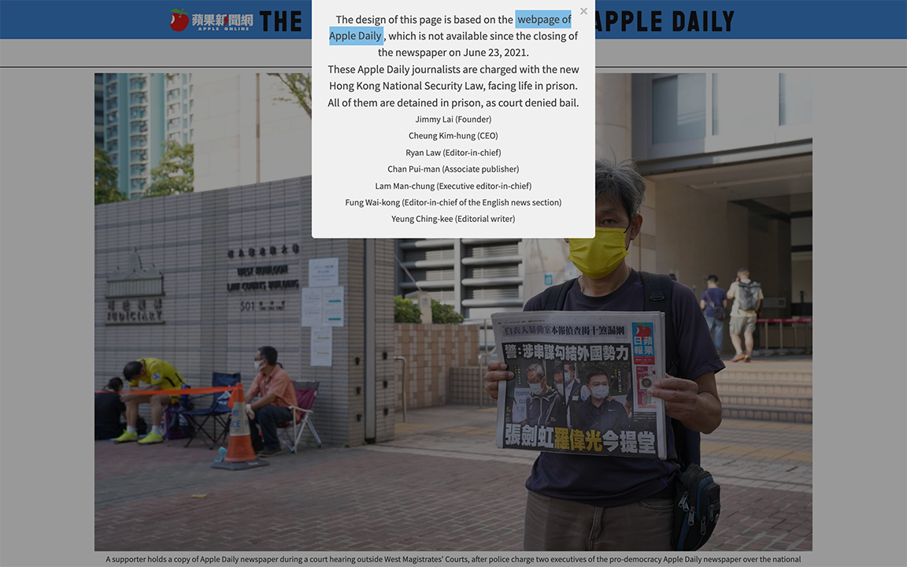
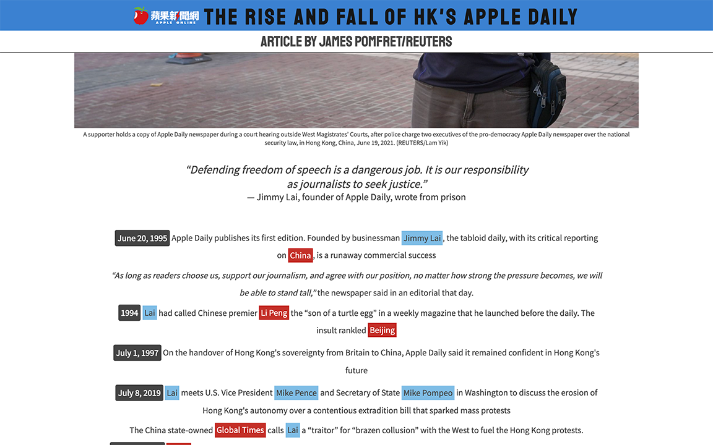

# The Rise and Fall of Apple Daily

This webpage is one of my project for [Responsive Web Design Certification](https://www.freecodecamp.org/learn/responsive-web-design/) on [freeCodeCamp](https://www.freecodecamp.org/): [Build a Tribute Page](https://www.freecodecamp.org/learn/responsive-web-design/responsive-web-design-projects/build-a-tribute-page).  
The design is cloned from the [webpage of Apple Daily](https://hk.appledaily.com/), which is not available since the paper's closure on June 23, 2021.

## Table of Content

- [Live Demo](#live-demo)
- [Final Product](#final-product)
- [Dependencies](#dependencies)
- [Getting Started](#getting-started)

## Live demo

This app is built on [codepen](https://codepen.io/) and export to distribute for this live demo:  
https://scc416.github.io/rise-and-fall-of-apple-daily/

## Final Product

|                                                                  |
| :--------------------------------------------------------------------------------------------: |
| _Dialog ([vex](https://github.hubspot.com/vex/docs/welcome/)) pops up when the page is loaded_ |

|    |
| :------------------------------: |
| _View of the webpage on desktop_ |

|     |
| :-----------------------------: |
| _View of the webpage on mobile_ |

## Dependencies

- [vex](https://github.hubspot.com/vex/docs/welcome/): dialog

## Getting Started

1. Clone or download this repository onto your local device.
2. Open `index.html` with browser.
